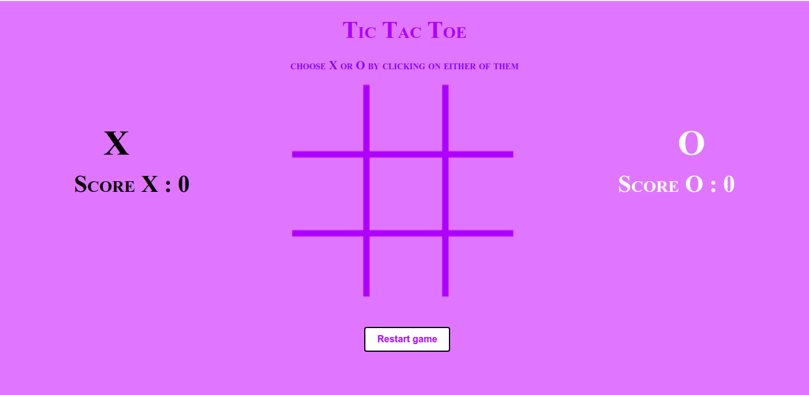

# tic-tac-toe
AI TicTacToe using the minimax algorithm

## How to run it?
Run the tictactoe.html in any browser and the game will start

## Demo

 
The above image is how the page looks on load. Here, the instruction is stated at the top and it says to choose either X or O. Then you can proceed with the game. Once the game ends, your score will be updated and you have an option to restart the game by clicking on the restart button. Your scores continue from the previous round, so good luck against the AI!
 

